# Shopping Cart
> Basically, it is a shopping cart application where you can see the categories with their products, add them to the cart and create an order after you sign up as a member.


## Table of Contents
* [General Info](#general-information)
* [Technologies Used](#technologies-used)
* [Setup](#setup)
* [Usage](#usage)
* [Contact](#contact)


## General Information
After registering and logging in, you can list the products with their features in this project. You can create database of products list from uploaded csv file or you can create one by one if you are an admin. You can create a shopping cart and create an order.


## Technologies Used
- Viper v1.10.1
- Gin v1.7.7
- Swagger v0.21.1
- Jwt v3.2.2
- Zap v1.21.0
- Postgres v1.3.1
- Gorm v1.23.3


## Setup
``` go
go get github.com/spf13/viper
```
```go
go get github.com/gin-gonic/gin
```
```go
go get github.com/go-openapi/swag
```
```go
go get github.com/golang-jwt/jwt
```
```go
go get go.uber.org/zap
```
```go
go get gorm.io/driver/postgres	
```
```go
go get gorm.io/gorm
```

## Usage
#### Sign Up
The member is registered by entering the user informations. Member informations and token return.
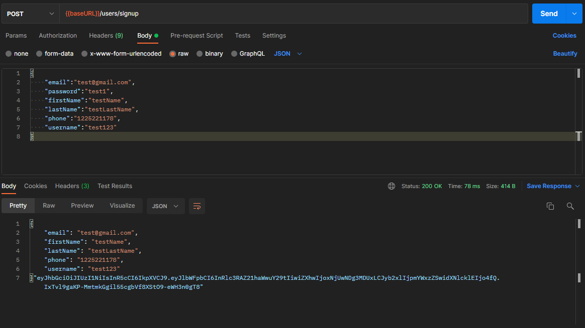
#### Login
Login by entering password and email information. Member information and token return.
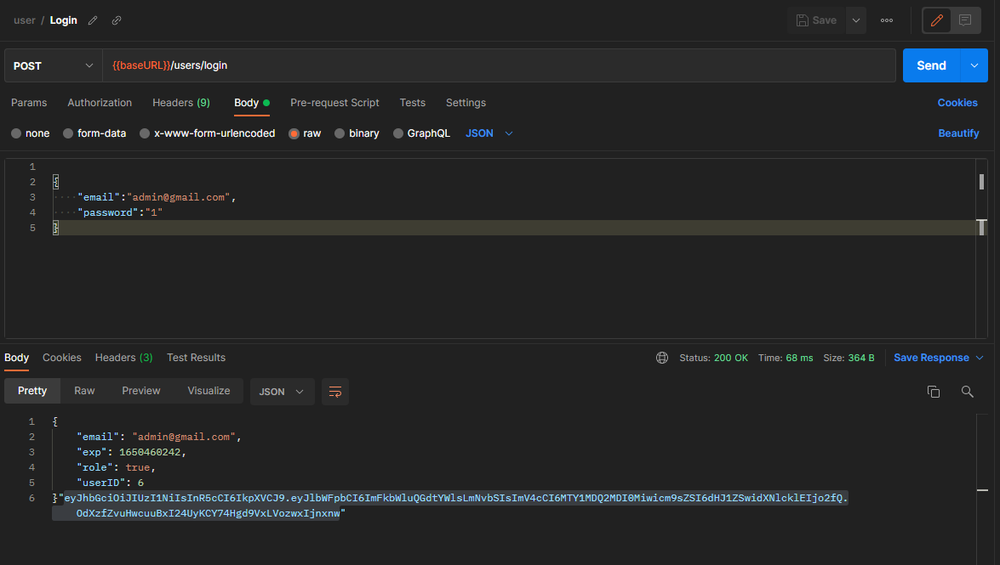
#### Decode Token
Token is given with Authorization key and then member information returns.
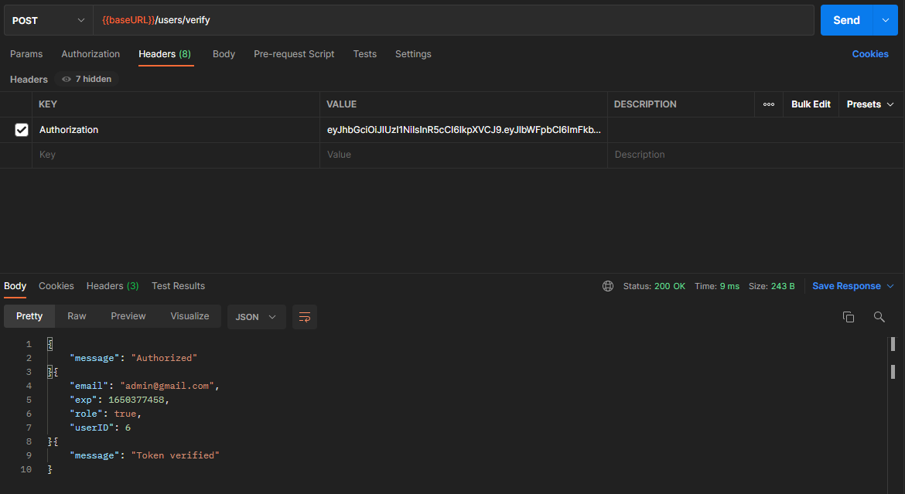
#### Get Products
Page and page size parameters are given, then products return with pagination.
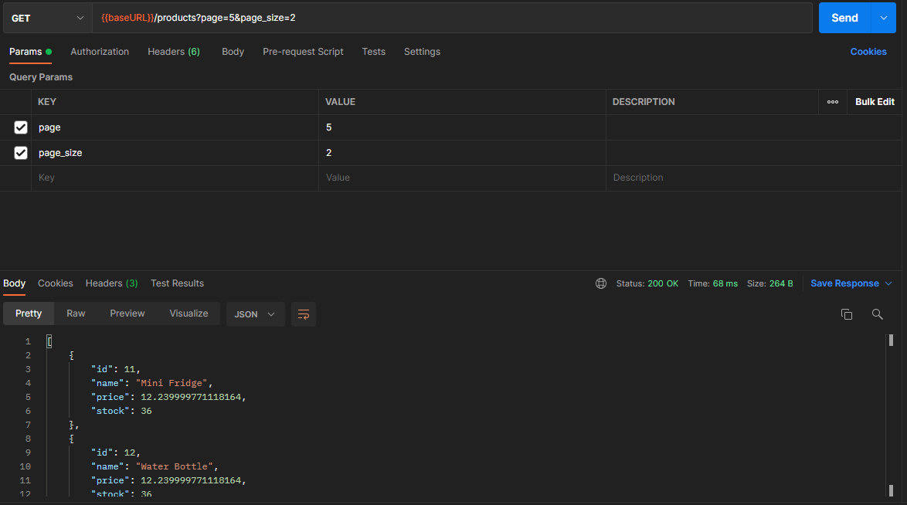
#### Get Product By ID
The product returns by typing the id in the endpoint.
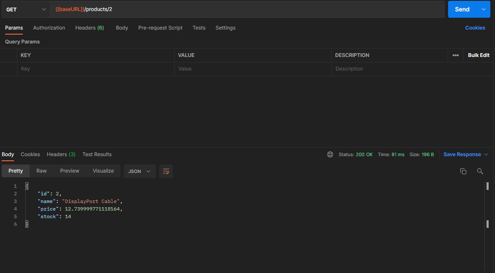
#### Get Product By Name
The product returns by typing the name in the endpoint.
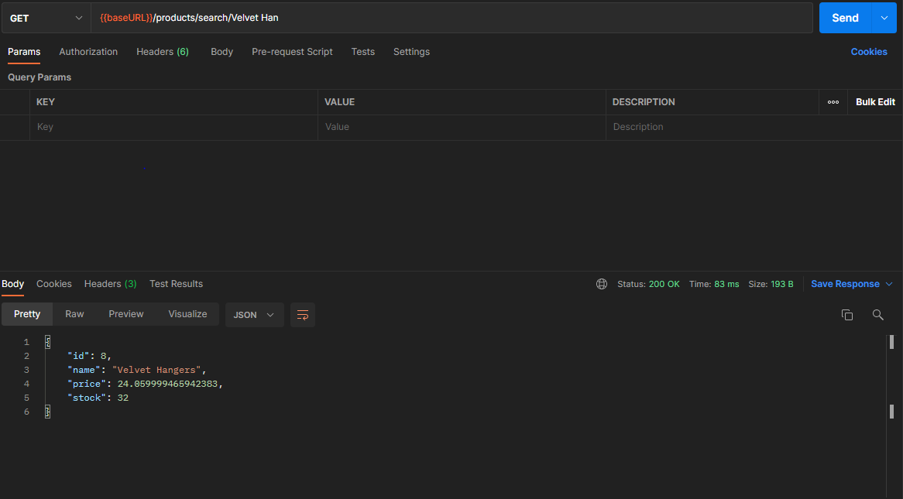
#### Create Product 
To create a product, it is necessary to give the token with the admin role to the header with the authorization key. Then, new product is created and returns with given product information.
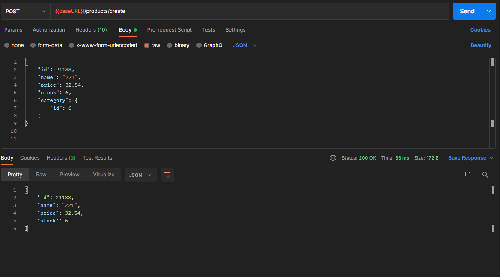
#### Create Product From Uploaded csv File 
Admin can create bulk via uploading csv file.
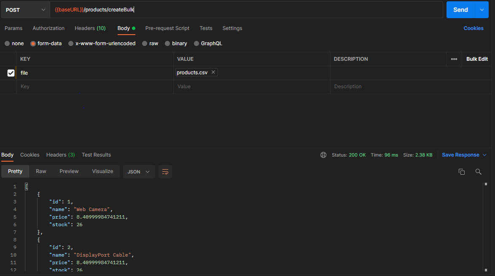
#### Category 
Similar work with product can be done for the category as well.
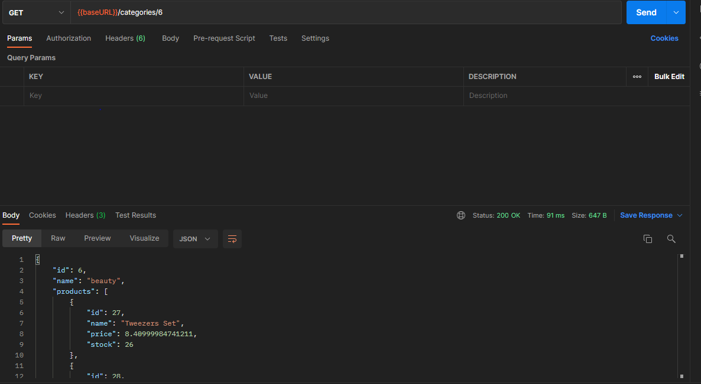
#### Verify Shopping Cart 
Shopping Cart can be created empty to database with authorization key.
#### Create Shopping Cart 
Shopping Cart can be created with authorization key and given product id and quantity to the endpoint.
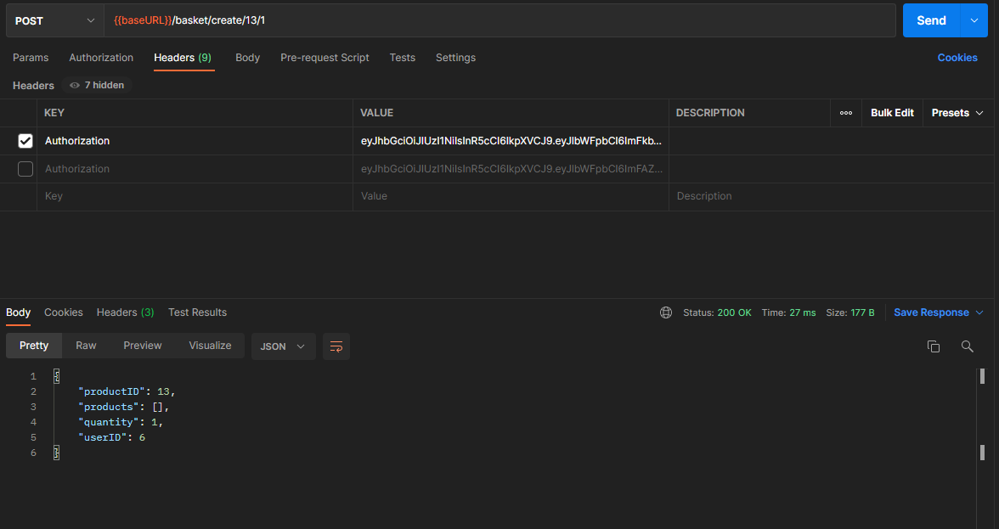
#### Increment And Decrement Product Quantity 
Product quantity can be increment or decrement with authorization key and given product id to the endpoint.
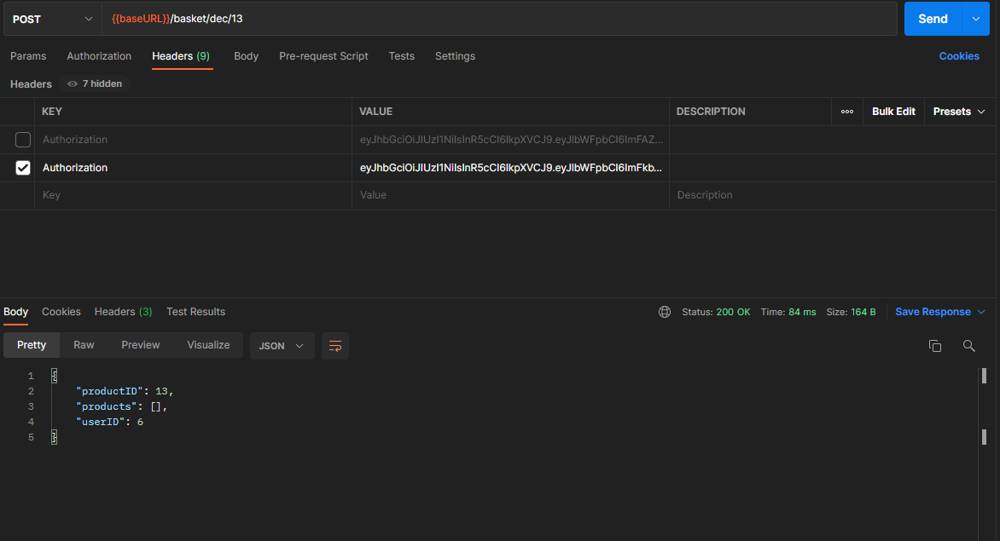
#### Get Product From The Cart
Product on the cart can be observed with authorization key and given product id to the endpoint.
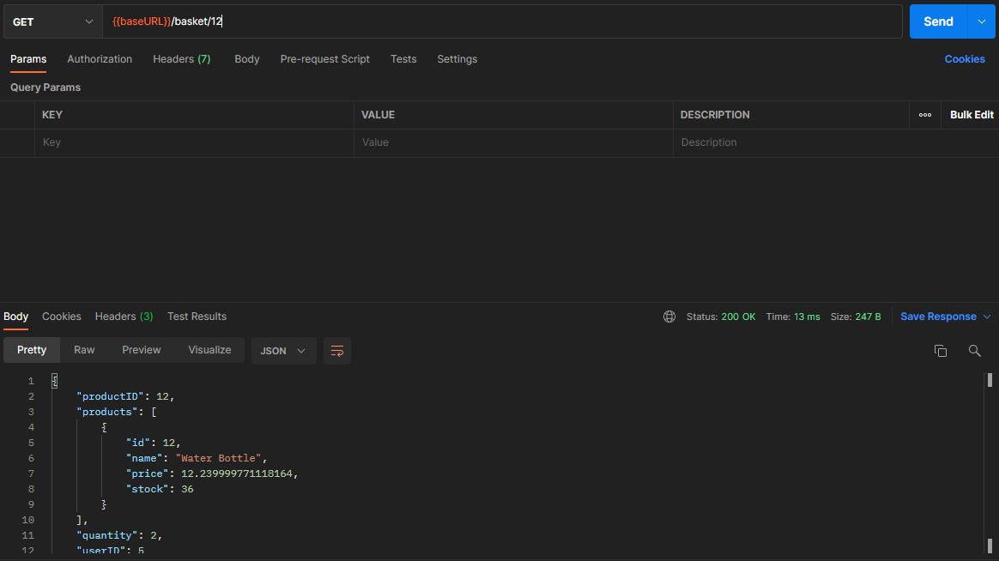
#### Get List Of All Added Products To The Cart
Products on the cart can be observed with authorization key.
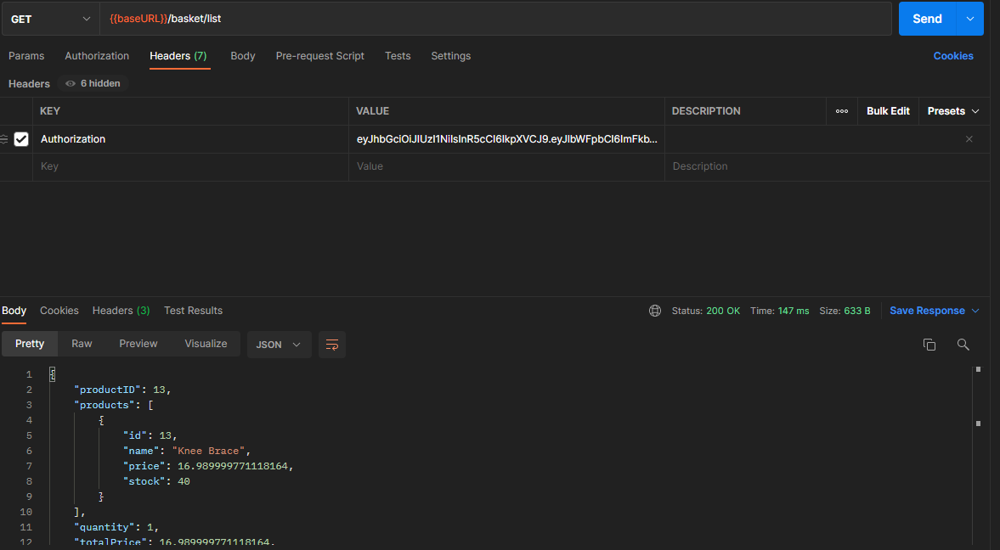
#### Buy Items
Products on the cart can be purchased with authorization key.
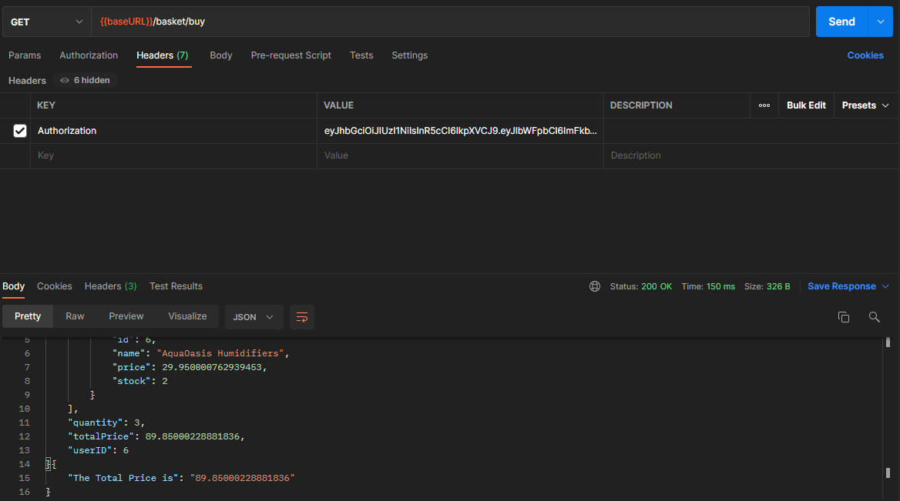
#### Cancel Order
The order can be canceled if 14 days have not passed.
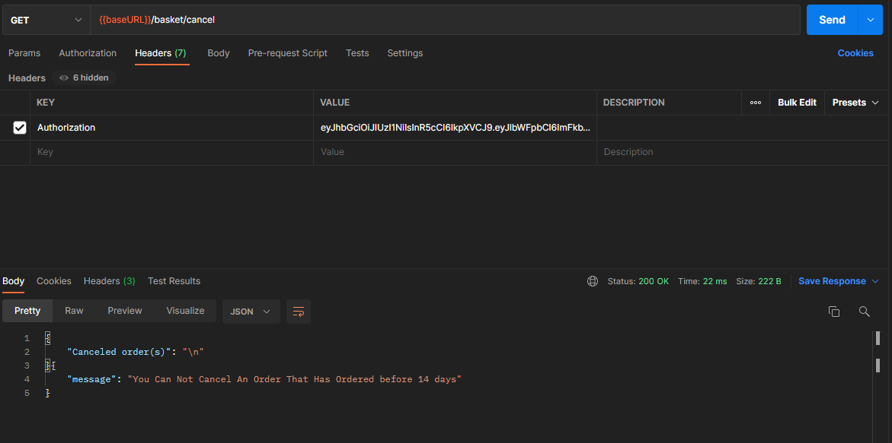
#### Order History
The passed order can be observed.
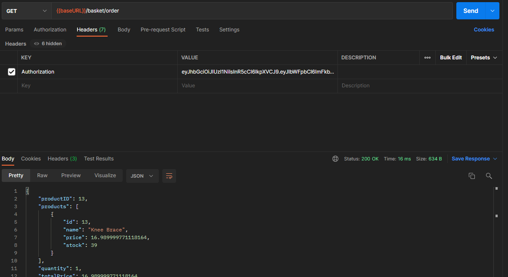


## Contact
Created by [@BatuhanSerin](https://github.com/BatuhanSerin)
